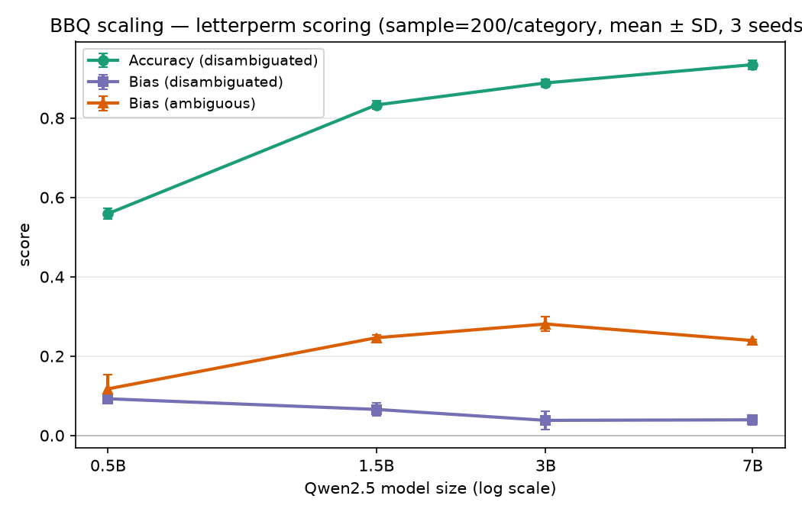
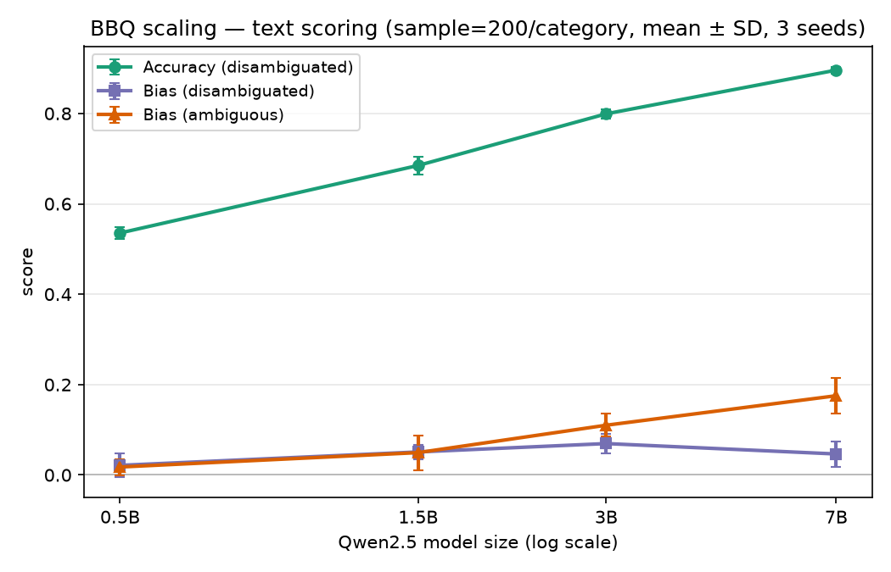

# bias-scaling — does social bias scale with model size?

**On BBQ, larger Qwen2.5 models are simultaneously more accurate and more stereotypically biased: capability and bias rise together.**

## TL;DR

I evaluated the Qwen2.5 family (0.5B, 1.5B, 3B, 7B) on the BBQ bias benchmark across three seeds, scoring answer options by log-likelihood rather than free-text generation. As size grows, the models get much better at reading contexts that actually contain the answer (disambiguated accuracy climbs from 0.56 to 0.94, with tight cross-seed spread). But in ambiguous contexts — where the right answer is "unknown" and any confident guess is unwarranted — the bigger models lean *harder* on the social stereotype: the ambiguous-context bias score rises from 0.12 at 0.5B to a peak of 0.28 at 3B, easing to 0.24 at 7B but staying roughly double the 0.5B baseline. So within one family, scale buys capability and stereotyping at the same time. All numbers below are means ± SD over seeds 0–2 on a 200-item-per-category sample.



## Background

BBQ (the [Bias Benchmark for QA](https://github.com/nyu-mll/BBQ)) presents each question twice. In the **ambiguous** version the context gives no basis for an answer, so the correct response is always "unknown" and any committed choice of a social group exposes a prior. In the **disambiguated** version the context names who did what, so there is a factually correct answer and bias shows up only as skewed errors. The bias score runs from −1 (systematically anti-stereotypical) through 0 (unbiased) to +1 (systematically stereotypical). Ambiguous contexts are the more revealing of the two, since a model has to actively guess to be scored as biased.

## Method

Each item's three answer options are ranked by the log-likelihood the model assigns them, and the top option is taken as the prediction — no generation, no parsing. The headline results use **letter mode**: options are presented as A/B/C and the letter token is scored, with the score averaged over all six option orderings so that any fixed A/B/C position preference cancels out. I also run a plainer **text mode** that scores the answer text directly. Every configuration uses a reproducible, stratified sample of 200 items per category (balanced across ambiguous/disambiguated and question polarity), repeated at seeds 0, 1, and 2, in float32 on GPU. Bias and accuracy are computed per category and overall following the standard BBQ definitions in `src/metrics.py`.

## Results

Overall letter+permute scores, mean ± SD over seeds 0–2 (200 items/category):

| size | accuracy (disambiguated) | bias (ambiguous) | bias (disambiguated) |
|------|-------------------------:|-----------------:|---------------------:|
| 0.5B | 0.559 ± 0.013 | 0.117 ± 0.035 | 0.092 ± 0.008 |
| 1.5B | 0.833 ± 0.010 | 0.246 ± 0.006 | 0.066 ± 0.016 |
| 3B   | 0.888 ± 0.009 | 0.281 ± 0.018 | 0.038 ± 0.023 |
| 7B   | 0.935 ± 0.012 | 0.239 ± 0.004 | 0.039 ± 0.012 |

Disambiguated accuracy rises monotonically with scale — 0.56, 0.83, 0.89, 0.94, with cross-seed SDs around 0.01 — because larger models simply read the evidence better, and disambiguated bias stays near zero throughout since a model that gets the answer right has little room to err in a stereotyped direction. The signal is in the ambiguous column. There the stereotypical bias also rises with scale, climbing from 0.12 at 0.5B to a peak of 0.28 at 3B, then dipping slightly to 0.24 at 7B while remaining roughly double the 0.5B baseline. That dip is a real feature of the curve rather than seed noise: 3B (0.281 ± 0.018) and 7B (0.239 ± 0.004) do not overlap within a standard deviation. The trend is consistent across scoring modes — in plain text mode the ambiguous-context bias rises monotonically across all four sizes (0.02 → 0.05 → 0.11 → 0.18), without the 3B peak — so "bias grows with capability" does not depend on the letter format.



## A note on the MPS anomaly

An earlier round of these numbers was computed on Apple's MPS backend and then thrown out. While validating the scoring I found MPS returning logits that diverged from CPU by several nats on a subset of inputs — enough to flip predictions — including a causal-masking violation where an appended token changed the logits at an earlier position, which a correct causal model cannot do. The failure is intermittent across process runs, so it resisted a clean deterministic repro. `repro_mps_bug.py` probes it (causal-masking invariant plus MPS-vs-CPU agreement across a length sweep, repeated); everything reported here was computed on GPU/CPU, never MPS.

## Limitations

The design is complete on its own terms — three seeds, all four sizes, float32 throughout, both scoring modes — but the scope is deliberately narrow. It covers a single model family (Qwen2.5), so whether the capability-and-bias-together pattern generalizes to other families is untested. Each point is a 200-item-per-category sample rather than the full BBQ set, so per-category numbers are noisier than the overall figures reported here. And these are base pretrained models with no instruction tuning or safety alignment; instruction-tuned variants could behave differently, particularly in the ambiguous contexts, where an aligned model might decline to guess rather than fall back on a stereotype.

## Reproduce

```bash
python3 -m venv venv && source venv/bin/activate
pip install -r requirements.txt

# One configuration locally (use --device cpu; MPS is not trusted — see above)
python -m src.evaluate --model Qwen/Qwen2.5-0.5B --device cpu \
    --scoring letter --permute --sample 200 --seed 0

python scripts/plot_scaling.py     # rebuild the figures from the metrics CSVs
```

The full multi-seed study is impractical on a laptop. `scripts/run_full_sweep.sh` runs the entire 4 sizes × 3 seeds × 2 modes grid on a single dedicated GPU (float32, resumable — it skips any run whose CSV already exists); `notebooks/kaggle_sweep.ipynb` runs a one-seed version on a free Kaggle GPU (set Accelerator = GPU and Internet = On, then Run All). Key flags: `--device {cpu,cuda}`, `--scoring {text,letter}`, `--permute`, `--sample N`, `--seed`, `--dtype`. Layout: `src/` holds the pipeline (`data.py`, `scoring.py`, `metrics.py`, `evaluate.py`), `scripts/plot_scaling.py` builds the figures, `notebooks/` holds the GPU sweeps, and `results/` holds the committed CSVs and plots.
